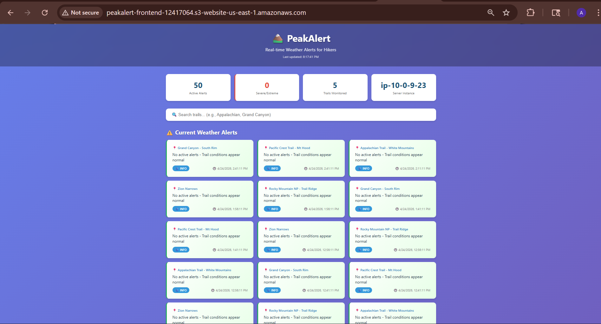
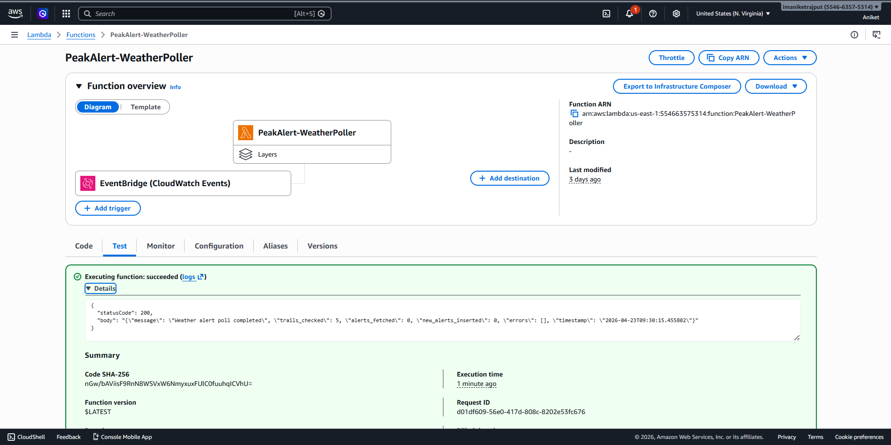
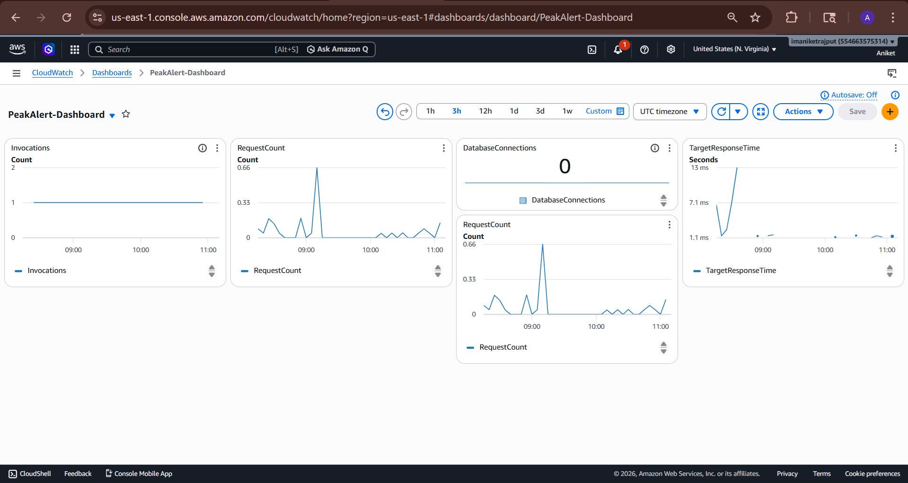
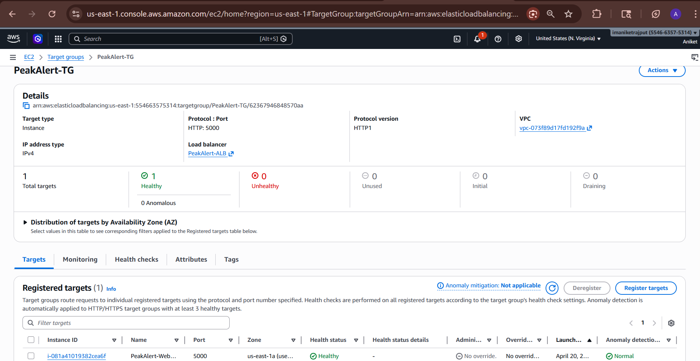
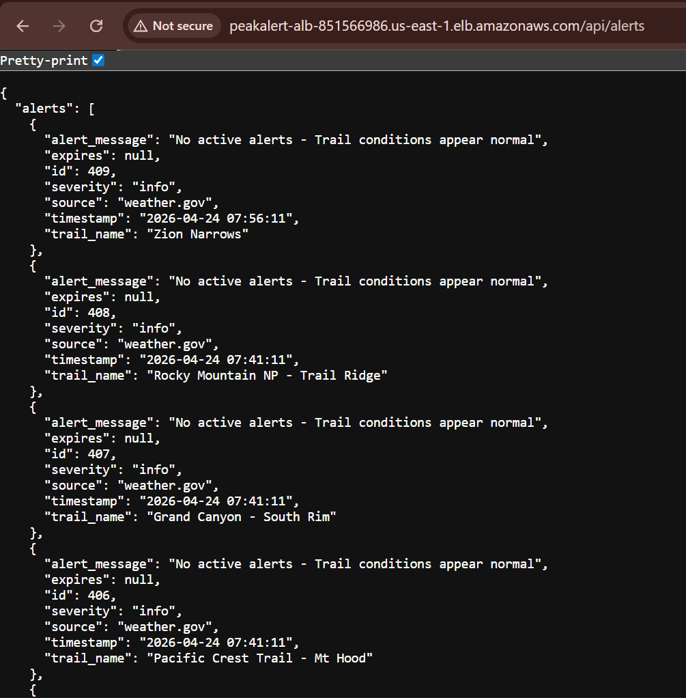
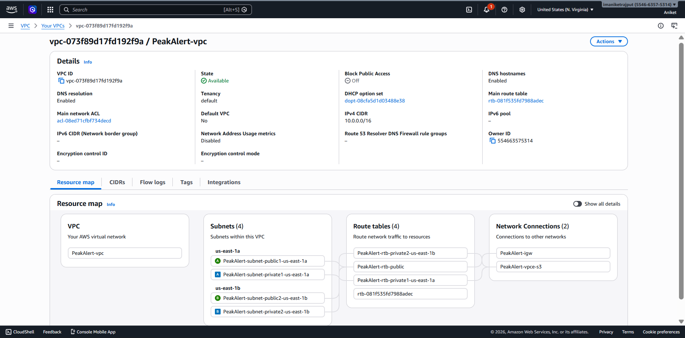

# 🏔️ PeakAlert — Real-time Weather Alert System for Hikers


> A fully automated cloud-native weather monitoring system built on
> Amazon Web Services that fetches live weather alerts from the US
> National Weather Service every 15 minutes — zero manual intervention.

---

## Live Demo

| Link | URL |
|------|-----|
| Frontend Dashboard | http://peakalert-frontend-12417064.s3-website-us-east-1.amazonaws.com |
| API Health Check | http://peakalert-alb-851566986.us-east-1.elb.amazonaws.com/health |
| Live Alerts API | http://peakalert-alb-851566986.us-east-1.elb.amazonaws.com/api/alerts |

> Note: EC2 and RDS are stopped to conserve AWS credits.
> Restart EC2 and RDS from AWS Console to make API live again.

---

## Screenshot



---

## What It Does

PeakAlert automatically:
- Polls weather.gov API every 15 minutes for 5 major hiking trails
- Stores weather alerts in RDS MySQL database
- Serves alert data through a Flask REST API on EC2
- Displays alerts on a real-time dashboard with severity colour-coding
- Monitors everything through CloudWatch with automated alarms

---

## AWS Architecture

### Services Used (9 Total)

| Service | Purpose |
|---------|---------|
| VPC | Custom network with public/private subnets |
| EC2 (t3.micro) | Runs Flask REST API with Gunicorn |
| RDS MySQL | Stores weather alerts persistently |
| Lambda (Python 3.12) | Polls weather.gov every 15 minutes |
| ALB | Load balancer with health checks |
| S3 | Hosts static frontend website |
| CloudFront | CDN for global delivery + HTTPS |
| EventBridge | Schedules Lambda every 15 minutes |
| CloudWatch | Monitoring dashboard + alarms |

---

## System Architecture Flow

### Data Collection Flow (Automated — runs every 15 minutes)
EventBridge (timer fires every 15 min)
→ Lambda wakes up automatically
→ Calls weather.gov API for 5 hiking trails
→ Saves new alerts to RDS MySQL
→ Deduplicates within 1 hour window
→ Deletes data older than 7 days


### User Request Flow (when someone opens the website)
User opens website URL
→ S3 serves HTML/CSS/JS via CloudFront CDN
→ JavaScript calls ALB endpoint for live data
→ ALB routes request to healthy EC2 instance
→ Flask queries RDS MySQL database
→ Returns JSON alert data
→ Dashboard renders colour-coded alert cards

---

## Project Structure
PeakAlert-AWS-Weather-Alert-System/
├── lambda/
│   └── lambda_function.py    # Polls weather.gov, writes to RDS
├── ec2/
│   └── app.py                # Flask REST API
├── frontend/
│   ├── index.html            # Dashboard UI
│   ├── style.css             # Styles with severity colours
│   ├── app.js                # Fetch calls + render logic
│   └── error.html            # Custom 404
├── Docs/
│   └── PeakAlert-Documentation.docx
├── Screenshot/
│   └── (screenshots of live system)
├── .gitignore
├── LICENSE
└── README.md

---

## API Endpoints

| Endpoint | Method | Description |
|----------|--------|-------------|
| `/health` | GET | Health check — returns instance status |
| `/api/alerts` | GET | Returns last 24hrs of alerts (max 50) |
| `/api/trails` | GET | Returns list of monitored trails |
| `/api/stats` | GET | Returns 7-day alert trend data |

### Sample API Response
```json
{
  "alerts": [
    {
      "trail_name": "Grand Canyon - South Rim",
      "alert_message": "No active alerts - Trail conditions appear normal",
      "severity": "info",
      "source": "weather.gov",
      "timestamp": "2026-04-24 07:41:11"
    }
  ],
  "count": 50,
  "instance": "ip-10-0-9-23.ec2.internal"
}
```

---

## Security Implementation

- **IAM Least Privilege** — Lambda role has only 2 policies
- **Security Groups** — EC2 port 5000 accessible only from ALB-SG
- **Encrypted Credentials** — DB password stored in Lambda env vars encrypted by KMS
- **CloudFront HTTPS** — All frontend traffic TLS encrypted
- **VPC Isolation** — All services inside private network

---

## Monitoring

CloudWatch Dashboard tracks:
- Lambda invocations (every 15 min pattern)
- ALB request count and response time (13ms average)
- RDS database connections
- EC2 CPU utilization

Alarms configured:
- CPU > 70% for 5 minutes → alarm fires
- Lambda errors > 2 in 15 minutes → alarm fires

---

## Challenges Solved

| Challenge | Solution |
|-----------|----------|
| MySQL 8.0 cryptography error in Lambda | Built custom Lambda Layer with Linux-compatible binaries |
| CORS blocking API calls from S3 to ALB | Added flask-cors to Flask application |
| CloudFront AccessDenied on S3 | Used S3 static website hosting endpoint |
| CloudShell command corruption | Rewrote all CLI commands as single-line |

---

## Future Enhancements

- [ ] Auto Scaling Group (min 2, max 5 EC2 instances)
- [ ] CI/CD pipeline with CodePipeline + CodeDeploy
- [ ] SNS push notifications for severe alerts
- [ ] AWS Secrets Manager for credential rotation
- [ ] Multi-region disaster recovery with Route 53 failover
- [ ] Add Indian weather data via OpenWeatherMap API

---

## Screenshots

| Dashboard | Lambda Test | CloudWatch |
|-----------|-------------|------------|
|  |  |  |

| ALB Healthy | API Response | VPC |
|-------------|--------------|-----|
|  |  |  |

---

## Built With

- **Cloud:** Amazon Web Services (AWS)
- **Backend:** Python 3.12, Flask, Gunicorn
- **Database:** MySQL 8.0 on Amazon RDS
- **Frontend:** HTML5, CSS3, Vanilla JavaScript
- **Data Source:** US National Weather Service (weather.gov)

---

## Author

**Aniket**
Student — School of Computer Science and Engineering
Lovely Professional University

[](https://www.linkedin.com/in/aniket-singh-as/)

---

## Acknowledgements

Special thanks to my mentor **Madhuri** for guidance
throughout this project.

---

*Built on AWS Free Tier | April 2026 | 9 Services | Production-Ready*
